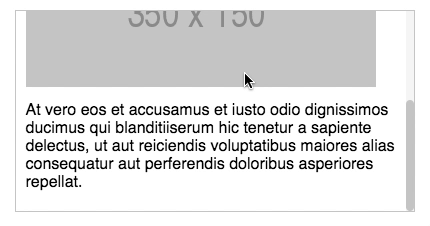

# React Scrolling List component



## Instalation

```shell
$ yarn add react-scrolling-list
```

## Usage

```javascript
import ScrollingList from 'react-scrolling-list'

<ScrollingList maxHeight="200px" color="#ccc">
    <p>Lorem ipsum dolor sit amet...</p>
    <SomeComponent />
    
</ScrollingList>

```

## Props

Prop | Type | Description
---- | ---- | -----------
color | String | Scrollbar color HEX value (default: #ccc)
maxHeight | String | Container max. height (default: 200px)
maxWidth | String | Container max. width (default: 100%)
style | Object | Reast style object
ClassName | String | Component css class name

## License

MIT